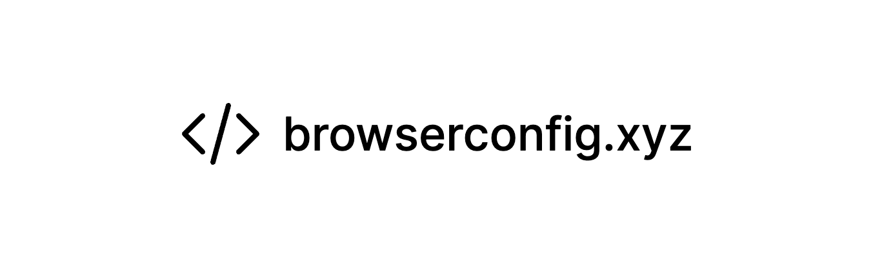

### /webapp

The next.js app you can find at https://browserconfig.xyz. This is where you create your configurations.

### /extension

A minimal chrome extension that acts as a global browser storage for the user. The IPFS content ID gets stored in the extension, and the content ID is because of that accesible by every website the user later visits. Can be found at https://chrome.google.com/webstore/detail/acblceepgdakhjhkmmkmafbbnhoobcef/preview?hl=sv&authuser=0.

### /package

A npm package that exposes hooks for getting the browser config of a visitor of your website. A user can set it's config at https://browserconfig.xyz, and by using this package you have an easy hook for accesing the user's config. Can be found at https://www.npmjs.com/package/browserconfig.xyz.
